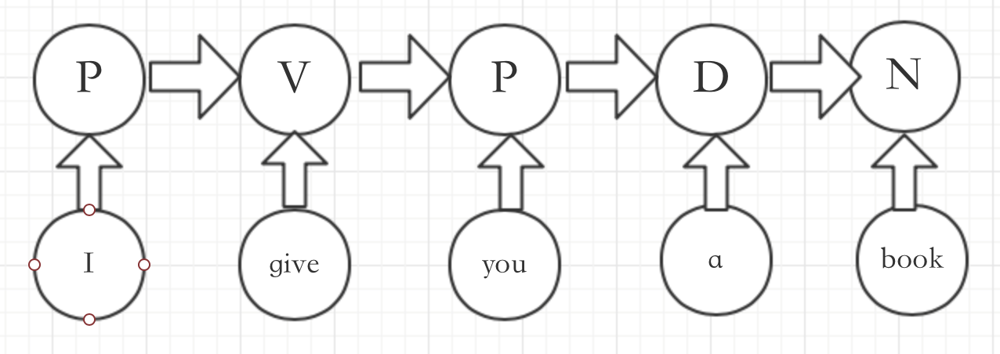

## 文本分类

教师：[邱锡鹏](http://nlp.fudan.edu.cn/xpqiu)  微博：[@邱锡鹏](http://weibo.com/xpqiu)

版权声明：本文为复旦nlp组施展根据课堂内容整理的原创文章，转载请注明出处。

### 1 文本分类任务简介

​	在有监督学习中,需要提供一组有类别标记的样本用来学习模型以及检验模型的好 坏。这组样本集合就称为数据集。数据集用 $X$ 表示,$X = {(x^1 , y^1 ), · · · , (x^N , y^N )}$,N 为 样本个数。$y^i$ 为样本实例 $x^i$ 的类别标记。在自然语言处理中,数据集也经常称为语料库。

其中$x^i$的为一组文本，$y^i$可以是一组标签如词性，也可以是一个标签如文本的类别
$$
x^i = (w_1...w_t...w_T)\\ 
y^i=(p_1...p_t...p_T)
$$
使用机器学习方法－即找到这样一个映射f， 使得$x^{i}->y^{i}$	

### 2 向量化

​	在机器学习算法中,样本实例一般是以连续变量或离散变量的形式存在的(也称为 特征),而在自然语言处理中一般都是文字形式。因此,在进行学习模型之前,需要进行 特征提取,将样本的原始表示转换为特征向量。

​	在机器学习中,为了更好地表示样本的属性,一般将样本表示成代数形式,称为样 本的特征,我们用$\phi(x)$。样本特征可以是一维或多维向量,$\phi(x) ∈ R_m,m$是向量维数。
$$
\phi(x) = \left(
		\begin{array} {ccc} \phi_1(x) \\ \phi_2 (x) \\ .\\ .\\ \phi_m(x)
		\end{array}
	      \right)
$$
​	自然语言处理中,数据都是以字符形式存在的。样本的原始表示一般是字符串序 列。为了便于使用机器学习方法,首先要把样本表示为向量形式。下面我们介绍几种常 用的特征表示方法。自然语言处理的,在构造了样本和样本集合之后,为了和后面的机 器学习算法相结合,我们将样本x 转变成向量φ(x)。在将字符表示转换成向量表示的过 程中需要很多中间步骤,我们把这些中间步骤都成为数据处理,并且尽可能的模块化。

#### 2.1 词袋模型

​	一种简单的方法是简单假设文本(如一个句子或一个文档)是由字、词组成的无序 多重集合,不考虑语法甚至词序。这就是在自然语言处理和信息检索中常用的词袋模型，词袋模型可以看成一种以词为基本单位的向量空间模型(Vector Space Model, VSM)。具体可见本课程chap3的slide

#### 2.2 N 元特征

​	词袋模型在需要深层分析的场合就会显得太过简化了。例如在语义分析里,“你打了 我”和“我打了你”,意思是相反的,但用词袋模型表示后,这两句话是向量表示的等价 的,这显然是不合理的。

​	N 元特征(N-gram 特征),顾名思义,就是由 N 个字或词组成的字符串,单元可以 是字或词。这里N是大于等于1的任意整数。如果N 为2,就叫做二元特征,如果N为 3,就叫做三元特征以此类推。

​	N 元特征可以看出是对词袋模型的一种改进方法。与 N 元特征相关的概念是 N 元语法模型。以中文句子“机器学习算法”为例,以字为基本单位的二元特征集合为:{机器,器 学,学习,习算,算法}。集合中每一项都是由二个相邻的字组成的的子串,长度为 2。这 些子串可以是有意义的词(例如:“学习”、“算法”),也可以是无任何意义的字符串(例 如:“器学”,“习算”)。但是这些无意义的子串也有可能在分类中起到很关键的作用。一 个长度为L的句子,可以提取出L − 1个二元特征。

​	有了 N 元特征集合,就可以利用词袋模型将文本表示为向量形式。随着 N 的增加, 可以抽取的特征就会越多,特征空间也会呈指数增加。这些高阶的特征出现的频率也会相对较低,对分类不但没有太多帮助,还会直接影响着后续处理的效率与复杂度。因此在一般的文本分类任务中,N 取 3 就足够了,并且同时也使用一元和二元特征,防止出现过拟合。

### 3 文本分类

​	经过特征抽取后,一个样本可以表示为 k 维特征空间中的一个点。为了对这个特征 空间中的点进行区分,就需要寻找一些超平面来将这个特征空间分为一些互不重叠的子 区域,使得不同类别的点分布在不同的子区域中,这些超平面就成为判别界面。

​	为了定义这些用来进行空间分割的超平面,就需要引入判别函数的概念。假设变量 z ∈ Rm为特征空间中的点,这个超平面由所有满足函数f(z) = 0的点组成。这里的f(z) 就称为判别函数。

​	有了判别函数,分类就变得很简单,就是看一个样本在特征空间中位于哪个区域, 从而确定这个样本的类别。  判别函数的形式多种多样,在自然语言处理中,最为常用的判别函数为线性函数。

#### 3.1 二分类问题

$$
\hat y =sign((f(z))) = sign(\theta^Tz+\theta_0)
$$

sign为符号函数，取判别函数f(z)的正负号，为方便，简写判别函数为
$$
f(z) ＝ \theta^Tz+\theta_0 = \sum_{i=1}^{k}\theta_iz_i + \theta_0 = \sum_{i=0}^{k} = \hat \theta^T \hat z
$$
其中$z_0=1$,$\hat\theta,\hat z$分别称为增广权重向量和增光特征向量。
$$
\hat z = \left( 
		\begin{array} {ccc} 1 \\  z_1\\ .\\ .\\  z_k
		\end{array}
        	\right) =  \left( 
        	\begin{array}{ccc}
		1 \\ \\ z \\ \\  \\  
		\end{array}
        	\right)
$$

$$
\hat \theta = \left( 
		\begin{array} {ccc} \theta_0 \\  \theta_1\\ .\\ .\\  \theta_k
		\end{array}
        	\right) =  \left( 
        	\begin{array}{ccc}
		\theta_0 \\ \\ \theta \\ \\  \\  
		\end{array}
        	\right)
$$

后面的分类器描述中,我们都采用简化的表示方法,并直接用 $θ , z$ 来表示增广权重向量和增广特征向量

#### 3.2 多分类问题

​	对于 C 类分类问题,需要定义 C 个判别函数。但是这种表示一般适用于类别 y 为离散变量的情况。在自然语言处理的很 多学习任务,类别 y 可以是更复杂的结构,比如多标签、层次化以及结构化等形式。为了更好的描述这些情况，可采用如下形式：
$$
\hat y = \mathop{argmax}_yf(\phi(x,y),\theta)  \hspace{5cm} 式3.2
$$
这里$\phi(x,y)$是包含了样本x和类别y混合信息的特征向量，$\theta=[\theta_1;\theta_2…;\theta_C]$

例子：
$$
\phi_1(x,y) =\left\{
\begin{array}{11}
1 &  \textrm{if x contains 'stock' and y is 'eco'}\\
0 & \textrm{otherwise} 
\end{array}
\right.
$$

$$
\phi_2(x,y)=\left\{
\begin{array}{11}
1 &  \textrm{if x contains 'stock' and y is 'sport'}\\
0 & \textrm{otherwise} 
\end{array}
\right..
$$

其中$x=w_1...w_{|V|}$ ，是个字典大小的向量。

总之：
$$
\phi(x,y) = \left( 
		\begin{array} {ccc} \phi_1(x,y) \\  \phi_2(x,y) \\.\\.\\ \phi_{|V|*k}(x,y) 
		\end{array}
        	\right)=\phi(x) \otimes \phi(y)
$$
其中：
$$
\phi_k(x) =\left\{
\begin{array}{11}
1 &  \textrm{if x contains c}_k\\
0 & \textrm{otherwise} 
\end{array}
\right.
$$
$c_k$是词典中第k个词。
$$
\phi_m(y) =\left\{
\begin{array}{11}
1 &  \textrm{if y is label}_m\\
0 & \textrm{otherwise} 
\end{array}
\right.
$$
$label_m$表示第m个标签。

再论式3.2：

$\phi(x,y)$ 为特征表示，$f(\phi,\theta)$为模型，一般在文本分类中为线性模型（由于我们可以构建足够复杂的特征表示，在高维空间中总是线性可分的），argmax 为解码过程，即寻求y解的过程，对于分类问题，看得分取高分即可。机器学习要学的参数是$\theta$。

### 4 词性标注

$y$的输出值可能不仅仅是分类值，可能也是一个序列值，如词性标注问题－输入一个序列，输出也是一个序列：

X：(S) I give you a book (E) 

y:  	     P   V     P    D   N

其中P为代词，V为动词，D为冠词，N为名词，(S)为开始符，(E)为结束符

1. 初级处理方法：

如(I, P),(give, V),(you,P),(a,D),(book,N) 构建一个多分类器

2. 进阶处理方法：

由于一个词的词性与其上下文相关，可以构建大小为n**窗口**，如n为1

可以增加以下：

((S) I give, N), (give you a, P)...

通过构建一个特征更多的多分类器。

**但是仍然存在一个问题：相近词的词性约束缺失。**

3. CRF(条件随机场)：

$$
\phi(x,y) = \sum_{i=1}^{L}\theta^T_i\phi(\vec{x},y_i)+\sum_{i=2}^{L}\theta_i^T\phi^{*}(\vec{x},y_{i-1},y_i)
$$
L为序列化输出y的长度。

 

其中$\phi(\vec x,y)$中特征抽取方式如下－假定窗口为1：
$$
\phi_1(x,y_i) =\left\{
\begin{array}{11}
1 &  if\ x_{i＋1}\ =\ 'a'\ and\ x_{i-1}\ =\ 'give'\ and \ y_{i}=P\\
0 & \textrm{otherwise} 
\end{array}
\right.
$$
其中$\phi^*(\vec x,y_{i-1},y_{i})$特征抽取方式如下:
$$
\phi^*(x,y_{i-1},y_{i}) \approx \phi^*(y_{i-1},y_{i})=\left\{
\begin{array}{11}
1 &  if\ y_{i-1}\ =\ V\ and \ y_{i}=P\\
0 & \textrm{otherwise} 
\end{array}
\right.
$$

### 5 感知器训练

#### 5.1训练算法

输入:训练集: $(x_i,y_i),i=1,···,N$,最大迭代次数:T 输出: $θ_k$

$θ_0=0;$
$k=1;$
$for\ t=1···T\ do$

​	$shuffle​$

​	$for\ i = 1 · · · N\ do$

​	选取一个样本 (xi , yi );

​	预测类别 $\hat y_t $;

​		$if\  \hat y_t = y_t\ then$

​			$θ_k =θ_{k−1}+(φ(x_t,y_t)−φ(x_t,\hat y_t));$

​			$k=k+1;$

​		$end$

​	$end$

$end$

$return\  θ_T ;$

算法要点：

1. 单个样本进行学习
2. 被动学习，只有预测值和实际值不同时才更新
3. 每次一轮迭代前进行shuffle
4. early-stop避免过拟合，将集合分成训练集，开发集和测试集。

#### 5.2 感知器收敛性

##### 5.2.1 定义

多类线性可分: 对于训练集$D = {(x_i,y_i)}_{i=1}^{n}$,如果存在一个正的常数$γ(γ > 0)$和权重向量$θ^∗$,并且$∥θ^∗ ∥ = 1$,对所有i都满足 $⟨θ^∗, φ(x_i, y_i)⟩ − ⟨θ^∗, φ(x_i, y)⟩ > γ, y \ne y_i (φ(x_i, y_i) ∈ R^m$ 为样本$x_i $的增 广特征向量),那么训练集$D$ 是线性可分的。

##### 5.2.2 定理

对于任何线性可分的训练集$D = {(x_i,y_i)}_{i=1}^{n}​$,假设 R 是所有样本中错误类别和真实类别在特征空间 φ(x, y) 最远的距离。

$R =\mathop {max}_imax_{z\ne y_i}∥φ(x_i,y_i)−φ(x_i,z)∥$

那么在5.1感知器学习算法中,总共的预测错误次数$K <\frac{R^2} {γ^2}$

